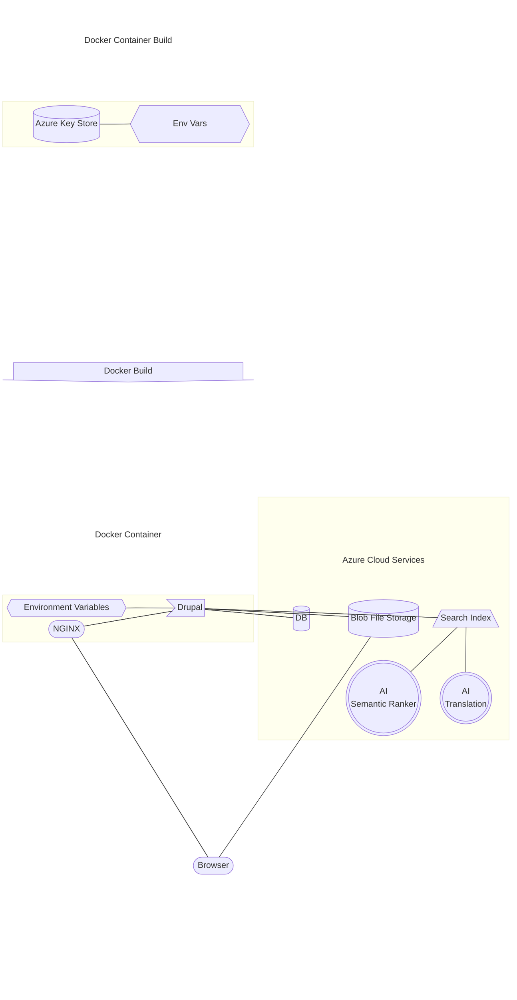

import Todo from '@site/src/components/Todo';

# Docker
A build will create a distributable container based on the `Dockerfile` found
in the repository root. This container will have everything necessary to run
Drupal & integrate it with necessary external services. Drupal primarily relies
on data stored in environment variables set during the build process.

## Build Workflow
<Todo />

## Azure Integration
Azure must be integrated with Drupal in order for many site features to work.
Please visit the [Drupal Azure Integrations documentation](../develop/drupal/integrations/azure)
for more information. Developers use the same configuration all cloud environments use.
